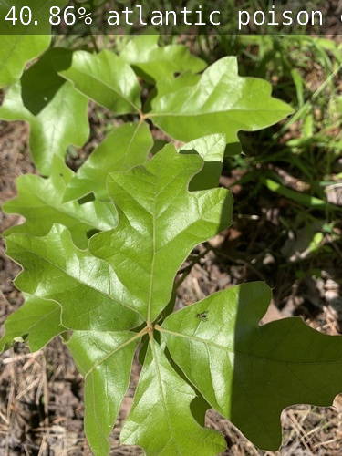

# Poisonous Plant Identifier

 Identifies common poisonous plants in the given input.

Model's attempt at identification

## The Algorithm

The algorithm was given a few thousand pictures of common poisonous plants in order to attemp to identify them. 80% of the pictures have been used to train the network while the rest is used to test and evaluate the training pictures. It can only identify three plants, specifically the Atlantic Poison Oak, the Eastern Poison Ivy and the Poison Sumac. This algorithm runs on a 4 GB Jetson Nano with the a pre-trained model that was modified to identify these plants.

## Installing jetson-inference

1. Access the terminal of your Jetson Nano through the PuTTy application
2. Enter its username an password
3. Run the command, sudo apt-get install git cmake
4. Run these commands in the listed order:
- git clone --recursive https://github.com/dusty-nv/jetson-inference
- cd jetson-inference
- git submodule update --init
5. Run the command, sudo apt-get install libpython3-dev python3-numpy
6. Run the command, cd jetson-inference
7. Run the command, mkdir build
8. Run these commands in the listed order:
- cd build
- cmake ../
9. Make no selections and press OK
10. Unselect and Pytorch installations and press OK
11. Run these commands in the listed order:
- make
- sudo make install
- sudo ldconfig

## Preparing VS Code

1. Make sure you have Visual Studio Code installed
2. Open VS Code and click the bottom-left icon in the corner
3. Select Connect to Host and add a new SSH host
4. Type ssh nvidia@(insert I.P adress). The I.P adress is the one for your Jetson Nano
5. Select the first config file on the list
6. Click Connect on the pop-up message
7. Select Linux as the operating program
8. Press Continue when prompted
9. When prompted, enter the password of your Jetson Nano
10. Open the jetson-inference folder and click Yes, I trust the authors

## Setting Up the Database

1. Download this [database](https://www.kaggle.com/datasets/sandramai/poisonous-plants)
2. Extract the files
3. Delete the Not folder
4. Create a new folder and go in it
5. Create folders named train, test and val
6. In each of those folders, create these folders
- atlantic_poison_oak
- eastern_poison_ivy
- poison_sumac
8. In the folder containing the train, test and val folders, create a file named labels.txt
9. Write these words in the text file in the given order
- atlantic poison oak
- eastern poison ivy
- poison sumac
10. Find the folder containing the pictures
11. Place about 80% of the Atlantic Poison Oak pictures into the train folder
12. Place about 10% into the test folder
13. Place about 10% into the val folder
14. Repeat for the other plant types

## Training the Model

1. Move the folder containing train, test and val onto the Jetson Nano with FileZilla
2. Move the folder in the following order
- jetson-inference
- python
- training
- classification
- data
3. Open VS Code
4. Open the terminal for the Jetson Nano
5. Run the command, cd jetson-inference
6. Run the command, ./docker/run.sh
7. Enter the password
8. Run the command, cd python/training/classification
9. Run the command, python3 train.py --model-dir=models/(folder name) data/(folder name) --epochs XXX. Replace the folder name with the folder containing the train, test and val folders. The XXX is replaced with a number of your choosing

## Running the Model

1. Run the command, python3 onnx_export.py --model-dir=models/(folder name)
2. Press Ctrl + D
3. Navigate to jetson-inference/python/training/classification on your terminal
4. Run these commands in the given order
- NET=models/(folder name)
- DATASET=data/(folder name)
5. Run the command, imagenet.py --model=$NET/resnet18.onnx --input_blob=input_0 --output_blob=output_0 --labels=$DATASET/labels.txt $DATASET/test/(plant folder name)/XXX.jpg OOO.jpg. Replace the plant folder name with one of the plants you have pictures for. Replace the XXX with a number in that folder. Replace OOO with anything
6. You should see the model start to work

[View a video explanation here](video link)
